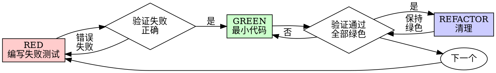

# Test-Driven Development (TDD)

## 概述

先写测试。观察它失败。编写最小的代码以通过。

**核心原则：** 如果你没有观察测试失败，你不知道它是否测试了正确的内容。

**违反规则的字面即是违反规则的精神。**

## 何时使用

**始终：**
- 新功能
- Bug 修复
- 重构
- 行为变更

**例外（询问你的伙伴）：**
- 一次性原型
- 生成的代码
- 配置文件

在想"就这一次跳过 TDD"？停下来。那是合理化。

## 铁律

```
没有失败的测试，不得编写生产代码
```

在测试之前写代码？删除它。重新开始。

**无例外：**
- 不要保留它作为"参考"
- 不要在写测试时"适配"它
- 不要看它
- 删除就是删除

从测试全新实施。句号。

## 红-绿-重构



### RED - 编写失败测试

编写一个最小测试，显示应该发生什么。

<Good>
```typescript
test('重试失败操作 3 次', async () => {
  let attempts = 0;
  const operation = () => {
    attempts++;
    if (attempts < 3) throw new Error('fail');
    return 'success';
  };

  const result = await retryOperation(operation);

  expect(result).toBe('success');
  expect(attempts).toBe(3);
});
```
清晰的名称，测试真实行为，一件事
</Good>

<Bad>
```typescript
test('重试有效', async () => {
  const mock = jest.fn()
    .mockRejectedValueOnce(new Error())
    .mockRejectedValueOnce(new Error())
    .mockResolvedValueOnce('success');
  await retryOperation(mock);
  expect(mock).toHaveBeenCalledTimes(3);
});
```
名称模糊，测试 mock 而非代码
</Bad>

**要求：**
- 一个行为
- 清晰的名称
- 真实代码（除非不可避免否则不 mock）

### 验证 RED - 观察它失败

**强制。永不跳过。**

```bash
npm test path/to/test.test.ts
```

确认：
- 测试失败（而不是错误）
- 失败消息符合预期
- 因为功能缺失而失败（而非拼写错误）

**测试通过？** 你在测试现有行为。修复测试。

**测试错误？** 修复错误，重新运行直到它正确失败。

### GREEN - 最小代码

编写最简单的代码以通过测试。

<Good>
```typescript
async function retryOperation<T>(fn: () => Promise<T>): Promise<T> {
  for (let i = 0; i < 3; i++) {
    try {
      return await fn();
    } catch (e) {
      if (i === 2) throw e;
    }
  }
  throw new Error('unreachable');
}
```
刚好足够通过
</Good>

<Bad>
```typescript
async function retryOperation<T>(
  fn: () => Promise<T>,
  options?: {
    maxRetries?: number;
    backoff?: 'linear' | 'exponential';
    onRetry?: (attempt: number) => void;
  }
): Promise<T> {
  // YAGNI
}
```
过度工程化
</Bad>

不要添加功能、重构其他代码或"改进"超出测试的内容。

### 验证 GREEN - 观察它通过

**强制。**

```bash
npm test path/to/test.test.ts
```

确认：
- 测试通过
- 其他测试仍然通过
- 输出干净（无错误、警告）

**测试失败？** 修复代码，不修复测试。

**其他测试失败？** 立即修复。

### REFACTOR - 清理

仅在绿色后：
- 移除重复
- 改进命名
- 提取助手

保持测试绿色。不要添加行为。

### 重复

为下一个功能编写下一个失败测试。

## 好的测试

| 质量 | 好 | 坏 |
|---------|------|------|
| **最小** | 一件事。名称中有"and"？拆分它。 | `test('验证 email 和 domain 和 whitespace')` |
| **清晰** | 名称描述行为 | `test('test1')` |
| **显示意图** | 演示期望的 API | 模糊代码应该做什么 |

编写或更改任何测试时，请阅读 [writing-good-tests.md](writing-good-tests.md) 以了解使测试诚实的规则：
- 命名会使测试失败的生产变更 — 在编写之前
- 断言真实行为，永不断言 mock 行为
- 将测试专用代码保留在测试工具中，而非生产类中
- 在 mock 依赖项之前了解其副作用

## 常见合理化

| 借口 | 现实 |
|--------|---------|
| "太简单无法测试" | 简单代码会崩溃。测试只需 30 秒。 |
| "我稍后会测试" | 之后写的测试立即通过——这证明不了什么。它们可能测试了错误的内容、测试实现而非行为，或遗漏了你忘记的边缘情况。你从未观察它失败，因此你从未证明它能捕获 bug。测试优先强制那种失败。 |
| "之后的测试达到相同目标（精神而非仪式）" | 测试之后回答"这是做什么？""我应该做什么？"测试之后写的测试受到你已经编写的代码的偏倚——你验证的是你记得的案例，而不是你会发现的案例。没有测试有效的证据的覆盖。 |
| "已经手动测试" | 手动测试是临时性的：没有覆盖内容的记录，没有方法在代码更改时重跑，在压力下容易忘记案例。"我试过有效" ≠ 全面。自动化测试每次都以相同方式运行。 |
| "删除 X 小时是浪费" | 沉没成本谬误——无论如何那段时间已经花掉。真正的选择：用 TDD 重写（高信心）与保留并稍后附加测试（低信心，可能有 bug）。保留你无法信任的代码即是浪费。 |
| "保留作为参考，先写测试" | 你会适配它。那是之后的测试。删除就是删除。 |
| "需要先探索" | 好的。丢弃探索，从 TDD 开始。 |
| "测试困难 = 设计不清晰" | 听测试。难以测试 = 难以使用。 |
| "TDD 会让我慢下来" | TDD 即务实路径：在提交前捕获 bug，防止回归，无惧地重构。"务实"的捷径意味着在生产中调试——更慢，不更快。 |
| "手动测试更快" | 手动不证明边缘情况。你将重新测试每个更改。 |
| "现有代码无测试" | 你在改进它。为现有代码添加测试。 |

## 红旗 - 停止并重新开始

- 测试前代码
- 实施后测试
- 测试立即通过
- 无法解释测试失败的原因
- 稍后添加测试
- 合理化"就这一次"
- "我已经手动测试它"
- "测试之后达到相同目的"
- "关乎精神而非仪式"
- "保留作为参考"或"适配现有代码"
- "已经花了 X 小时，删除是浪费"
- "TDD 是教条，我务实"
- "这不同因为..."

**所有这些都意味着：删除代码。从 TDD 重新开始。**

## 示例：Bug 修复

**Bug：** 接受空 email

**RED**
```typescript
test('拒绝空 email', async () => {
  const result = await submitForm({ email: '' });
  expect(result.error).toBe('Email required');
});
```

**验证 RED**
```bash
$ npm test
FAIL: 期望 'Email required'，得到 undefined
```

**GREEN**
```typescript
function submitForm(data: FormData) {
  if (!data.email?.trim()) {
    return { error: 'Email required' };
  }
  // ...
}
```

**验证 GREEN**
```bash
$ npm test
PASS
```

**REFACTOR**
如需要为多个字段提取验证。

## 验证清单

在标记工作完成之前：

- [ ] 每个新函数/方法都有测试
- [ ] 在实施前观察每个测试失败
- [ ] 每个测试因预期原因失败（功能缺失，而非拼写错误）
- [ ] 编写最小代码以通过每个测试
- [ ] 所有测试通过
- [ ] 输出干净（无错误、警告）
- [ ] 测试使用真实代码（仅在不可避免时 mock）
- [ ] 边缘情况和错误覆盖

无法勾选所有框？你跳过了 TDD。重新开始。

## 卡住时

| 问题 | 解决方案 |
|---------|---------|
| 不知道如何测试 | 编写期望的 API。先编写断言。询问你的伙伴。 |
| 测试过于复杂 | 设计过于复杂。简化接口。 |
| 必须 mock 一切 | 代码耦合过紧。使用依赖注入。 |
| 测试设置庞大 | 提取助手。仍然复杂？简化设计。 |

## 调试集成

发现 Bug？编写失败测试复现它。遵循 TDD 循环。测试证明修复并防止回归。

绝不在没有测试的情况下修复 bug。

## 最终规则

```
生产代码 → 测试存在且首先失败
否则 → 不是 TDD
```

未经你的伙伴允许，无例外。