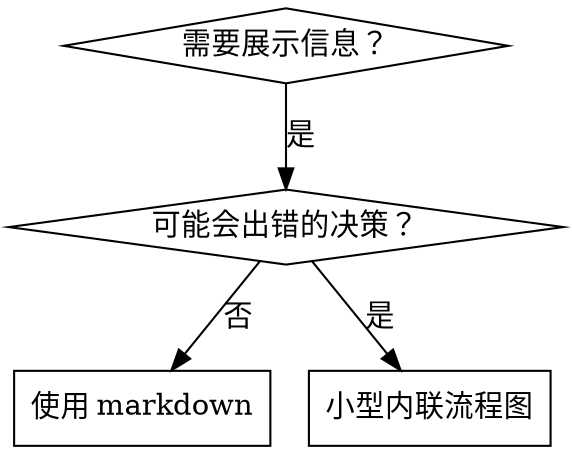

# Writing Skills

## 概述

**写 skill 就是将 TDD 应用于流程文档。**

**个人 skill 存放在运行时的 skills 目录中**（Claude Code 在 `~/.claude/skills/`）——在 Codex / Copilot CLI / Gemini CLI 上亦可使用跨运行时的别名 `~/.agents/skills/`。

你写测试用例（带子代理的压力场景），观察它们失败（基线行为），写 skill（文档），观察测试通过（代理合规），并重构（堵漏）。

**核心原则：** 如果你没有观察代理在没有 skill 时失败，你就不知道这个 skill 是否在教正确的东西。

**必需背景：** 在使用本 skill 之前，你必须理解 superpowers:test-driven-development——它定义了基本的 RED-GREEN-REFACTOR 循环。本 skill 把 TDD 适配到文档。

**官方指引：** 关于 Anthropic 官方 skill 编写最佳实践，参见 anthropic-best-practices.md。本文档补充 TDD 聚焦方法之外的其他模式与指引。

## 什么是 Skill？

**skill** 是一份针对成熟技术、模式或工具的参考指南。skill 帮助未来的代理找到并应用有效的方法。

**skill 是：** 可复用的技术、模式、工具、参考指南

**skill 不是：** 关于你如何一次性解决问题的叙事

## Skill 的 TDD 映射

| TDD 概念 | Skill 创建 |
|---|---|
| **测试用例** | 带子代理的压力场景 |
| **生产代码** | Skill 文档（SKILL.md） |
| **测试失败（RED）** | 代理在没有 skill 时违反规则（基线） |
| **测试通过（GREEN）** | 代理在 skill 存在时合规 |
| **重构** | 保持合规的同时堵漏 |
| **先写测试** | 写 skill 之前运行基线场景 |
| **观察它失败** | 记录代理使用的确切合理化 |
| **最小代码** | 写直接针对那些违规的 skill |
| **观察它通过** | 验证代理现在合规 |
| **重构循环** | 发现新合理化 → 堵漏 → 重新验证 |

整个 skill 创建过程遵循 RED-GREEN-REFACTOR。

## 何时创建 Skill

**何时创建：**
- 该技巧对你来说不是直观显而见的
- 你会跨项目再次参考它
- 模式适用广泛（非项目特定）
- 别人会受益

**何时不创建：**
- 一次性解决方案
- 在别处有完善文档的标准实践
- 项目特定的约定（放入你的指令文件）
- 机械约束（如果能用正则/验证强制执行，就自动化——把文档留给判断调用）

## Skill 类型

### 技术
带步骤的具体方法（condition-based-waiting、root-cause-tracing）

### 模式
看待问题的方式（flatten-with-flags、test-invariants）

### 参考
API 文档、语法指南、工具文档（office docs）

## 目录结构

```
skills/
  skill-name/
    SKILL.md              # 主要参考（必需）
    supporting-file.*     # 仅在需要时
```

**扁平的命名空间**——所有 skill 在一个可搜索的命名空间中

**何时拆为独立文件：**
1. **重引用**（100+ 行）——API 文档、综合语法
2. **可复用工具**——脚本、工具、模板

**何时内联：**
- 原则与概念
- 代码模式（< 50 行）
- 其他全部

## SKILL.md 结构

**Frontmatter（YAML）：**
- 两个必需字段：`name` 与 `description`（参见 [agentskills.io/specification](https://agentskills.io/specification) 了解全部受支持字段）
- 总计最大 1024 字符
- `name`：仅使用字母、数字与连字符（不要括号、特殊字符）
- `description`：第三人称，仅描述何时使用（不描述做了什么）
  - 以 "Use when..." 开头聚焦触发条件
  - 包含具体症状、情境与上下文
  - **绝不**总结 skill 的流程或工作流（见 SDO 一节说明原因）
  - 控制在 500 字符内

```markdown
# Skill 名称

## 概述
这是什么？1-2 句话的核心原则。

## 何时使用
[小型内联流程图——若决策不明显]

带症状与用例的项目列表
何时不使用

## 核心模式（针对技术/模式）
前后代码对比

## 快速参考
表格或项目符号用于扫描常见操作

## 实施
简单模式的内联代码
重引用或可复用工具的链接

## 常见错误
出错的地方 + 修复

## 实际影响（可选）
具体结果
```

## Skill 发现优化（SDO）

**对发现性至关重要：** 未来的代理需要找到你的 skill。

### 1. 丰富的 Description 字段

**目的：** 你的代理读取 description 以决定当前任务应加载哪些 skill。让它回答："我现在应该读这个 skill 吗？"

**格式：** 以 "Use when..." 开头，聚焦触发条件

**关键：Description = 何时使用，而非 skill 做了什么**

description 应仅描述触发条件。不要在 description 中总结 skill 的流程或工作流。

**为何重要：** 测试显示，当 description 总结 skill 的工作流时，代理可能遵循 description 而不读取完整 skill 内容。一条说"任务间代码评审"的 description 让代理只做一次评审，即便 skill 的流程图清楚显示两次评审（先是规范合规，再是代码质量）。

当 description 被改为仅仅"Use when executing implementation plans with independent tasks"（不总结工作流）时，代理正确读取了流程图并遵循两阶段评审流程。

**陷阱：** 总结工作流的 description 创造了代理会走的捷径。skill 正文变成被跳过的文档。

```yaml
# ❌ 坏：总结工作流 — 代理可能遵循此而非读取 skill
description: Use when executing plans - dispatches subagent per task with code review between tasks

# ❌ 坏：太多流程细节
description: Use for TDD - write test first, watch it fail, write minimal code, refactor

# ✅ 好：仅触发条件，无工作流总结
description: Use when executing implementation plans with independent tasks in the current session

# ✅ 好：仅触发条件
description: Use when implementing any feature or bugfix, before writing implementation code
```

**内容：**
- 使用具体的触发器、症状与情境，表明该 skill 适用
- 描述*问题*（竞态条件、行为不一致）而非*语言特定症状*（setTimeout、sleep）
- 让触发器与技术无关，除非 skill 本身是技术特定的
- 若 skill 是技术特定的，在触发器中显式声明
- 使用第三人称（注入到系统提示中）
- **绝不**总结 skill 的流程或工作流

```yaml
# ❌ 坏：太抽象、模糊、未包含何时使用
description: For async testing

# ❌ 坏：第一人称
description: I can help you with async tests when they're flaky

# ❌ 坏：提及技术但 skill 并非技术特定
description: Use when tests use setTimeout/sleep and are flaky

# ✅ 好：以 "Use when" 开头，描述问题，无工作流
description: Use when tests have race conditions, timing dependencies, or pass/fail inconsistently

# ✅ 好：技术特定 skill 与显式触发器
description: Use when using React Router and handling authentication redirects
```

### 2. 关键词覆盖

使用代理会搜索的词：

- 错误信息："Hook timed out"、"ENOTEMPTY"、"race condition"
- 症状："flaky"、"hanging"、"zombie"、"pollution"
- 同义词："timeout/hang/freeze"、"cleanup/teardown/afterEach"
- 工具：实际命令、库名、文件类型

### 3. 描述性命名

**使用主动语态、动词优先：**

- ✅ `creating-skills` 而非 `skill-creation`
- ✅ `condition-based-waiting` 而非 `async-test-helpers`

### 4. Token 效率（关键）

**问题：** getting-started 与频繁引用的 skill 会加载进每次对话。每个 token 都重要。

**目标字数：**

- getting-started 工作流：每个 < 150 词
- 频繁加载 skill：总计 < 200 词
- 其他 skill：< 500 词（仍保持简洁）

**技巧：**

**将细节移到工具帮助：**
```bash
# ❌ 坏：在 SKILL.md 中记录所有 flag
search-conversations supports --text, --both, --after DATE, --before DATE, --limit N

# ✅ 好：引用 --help
search-conversations supports multiple modes and filters. Run --help for details.
```

**使用交叉引用：**
```markdown
# ❌ 坏：重复工作流细节
When searching, dispatch subagent with template...
[20 行重复指令]

# ✅ 好：引用其他 skill
Always use subagents (50-100x context savings). REQUIRED: Use [other-skill-name] for workflow.
```

**压缩示例：**
```markdown
# ❌ 坏：啰嗦示例（42 词）
your human partner: "How did we handle authentication errors in React Router before?"
You: I'll search past conversations for React Router authentication patterns.
[Dispatch subagent with search query: "React Router authentication error handling 401"]

# ✅ 好：最小示例（20 词）
Partner: "How did we handle auth errors in React Router?"
You: Searching...
[Dispatch subagent → synthesis]
```

**消除冗余：**
- 不要重复交叉引用 skill 中的内容
- 不要解释命令本身显而易见的内容
- 不要包含同一模式的多个示例

**验证：**
```bash
wc -w skills/path/SKILL.md
# getting-started 工作流：目标 < 150 词
# 其他频繁加载：目标总计 < 200 词
```

**按你做的或核心洞见命名：**
- ✅ `condition-based-waiting` > `async-test-helpers`
- ✅ `using-skills` 而非 `skill-usage`
- ✅ `flatten-with-flags` > `data-structure-refactoring`
- ✅ `root-cause-tracing` > `debugging-techniques`

**动名词（-ing）适合描述过程：**
- `creating-skills`、`testing-skills`、`debugging-with-logs`
- 主动、描述你正在做的动作

### 5. 交叉引用其他 Skill

**当编写引用其他 skill 的文档时：**

仅使用 skill 名，并带显式的必需标记：
- ✅ 好：**REQUIRED SUB-SKILL:** Use superpowers:test-driven-development
- ✅ 好：**REQUIRED BACKGROUND:** You MUST understand superpowers:systematic-debugging
- ❌ 坏：See skills/testing/test-driven-development（不清楚是否必需）
- ❌ 坏：@skills/testing/test-driven-development/SKILL.md（强制加载，消耗上下文）

**为何不用 @ 链接：** `@` 语法立即强制加载文件，在你需要之前就消耗 200k+ 上下文。

## 流程图用法



**仅在以下情况使用流程图：**
- 非显而见的决策点
- 可能过早停止的流程循环
- "何时使用 A vs B" 的决策

**绝不在以下情况使用流程图：**
- 参考材料 → 表格、列表
- 代码示例 → Markdown 块
- 线性指令 → 编号列表
- 无语义含义的标签（step1、helper2）

参见本目录中的 `graphviz-conventions.dot` 获取 graphviz 风格规则。

**为你的伙伴可视化：** 使用本目录中的 `render-graphs.js` 将 skill 的流程图渲染为 SVG：
```bash
./render-graphs.js ../some-skill           # 每个图分开
./render-graphs.js ../some-skill --combine # 全部图合并为一个 SVG
```

## 代码示例

**一个出色示例胜过多个平庸示例**

选择最相关的语言：

- 测试技术 → TypeScript/JavaScript
- 系统调试 → Shell/Python
- 数据处理 → Python

**好示例：**
- 完整且可运行
- 充分注释解释为何
- 来自真实场景
- 清晰展示模式
- 准备好适配（非通用模板）

**不要：**
- 用 5+ 语言实现
- 创建填空模板
- 写造作的示例

你善于移植——一个出色的示例就够了。

## 文件组织

### 自包含 Skill
```
defense-in-depth/
  SKILL.md    # 全部内联
```
何时：所有内容都合得下，无需重引用。

### 带可复用工具的 Skill
```
condition-based-waiting/
  SKILL.md    # 概述 + 模式
  example.ts  # 可适配的工作助手
```
何时：工具是可复用代码，不只是叙述。

### 带重引用的 Skill
```
pptx/
  SKILL.md       # 概述 + 工作流
  pptxgenjs.md   # 600 行 API 参考
  ooxml.md       # 500 行 XML 结构
  scripts/       # 可执行工具
```
何时：参考材料太大无法内联。

## 铁律（与 TDD 相同）

```
没有失败的测试，不得编写 skill
```

这适用于**新 skill 与现有 skill 的修改**。

写 skill 之前测试？删除它，重新开始。
没有测试就修改 skill？同样违反。

**无例外：**
- 不适用于"简单补充"
- 不适用于"只是增加一节"
- 不适用于"文档更新"
- 不要把未测试的修改保留为"参考"
- 不要在运行测试时"适配"它
- 删除就是删除

**必需背景：** superpowers:test-driven-development skill 解释了为何这重要。相同原则适用于文档。

## 测试所有 Skill 类型

不同 skill 类型需要不同的测试方法：

### 纪律约束型 Skill（规则/要求）

**示例：** TDD、verification-before-completion、designing-before-coding

**测试方式：**
- 学术问题：他们理解规则吗？
- 压力场景：他们在压力下合规吗？
- 多重压力叠加：时间 + 沉没成本 + 疲惫
- 识别合理化并添加显式反驳

**成功标准：** 代理在最大压力下遵循规则

### 技术型 Skill（how-to 指南）

**示例：** condition-based-waiting、root-cause-tracing、defensive-programming

**测试方式：**
- 应用场景：他们能正确应用技术吗？
- 变化场景：他们处理边缘情况吗？
- 缺失信息测试：指令有缺口吗？

**成功标准：** 代理成功将技术应用于新场景

### 模式型 Skill（心智模型）

**示例：** reducing-complexity、information-hiding 概念

**测试方式：**
- 识别场景：他们识别模式何时适用吗？
- 应用场景：他们能使用该心智模型吗？
- 反例：他们知道何时不适用吗？

**成功标准：** 代理正确识别何时/如何应用模式

### 参考型 Skill（文档/API）

**示例：** API 文档、命令参考、库指南

**测试方式：**
- 检索场景：他们能找到正确信息吗？
- 应用场景：他们能正确使用找到的内容吗？
- 缺口测试：常见用例被覆盖吗？

**成功标准：** 代理找到并正确应用参考信息

## 跳过测试的常见合理化

| 借口 | 现实 |
|--------|---------|
| "Skill 显然很清晰" | 你觉得清晰 ≠ 其他代理觉得清晰。测试它。 |
| "这只是个参考" | 参考可能有缺口、不清晰章节。测试检索。 |
| "测试是过度" | 未测试的 skill 总会有问题。总是。15 分钟测试省下几小时。 |
| "如果出问题我会测试" | 问题 = 代理无法使用 skill。在部署前测试。 |
| "测试太乏味" | 测试比调试生产环境坏 skill 少乏味。 |
| "我有信心它很好" | 过度自信保证问题。仍要测试。 |
| "学术审阅足够" | 阅读 ≠ 使用。测试应用场景。 |
| "没时间测试" | 部署未测试 skill 会浪费更多时间在之后修复它。 |

**所有这些都意味着：在部署前测试。无例外。**

## 形式匹配失败

在写指引之前，对基线失败进行分类。能挡住一种失败类型的形式，会在另一种类型上明确反咬。

| 基线失败 | 正确形式 | 错误形式 |
|---|---|---|
| 压力下跳过/违反规则（明知仍做） | 禁止 + 合理化表 + 红旗（见 Bulletproofing） | 软指引（"prefer..."、"consider..."） |
| 合规，但输出形状错误（提示膨胀、verdict 被埋、重述规范） | 正面配方或契约：说明输出*是*什么——按顺序的部分 | 禁止列表（"不要重述"、"绝不叙述"） |
| 从他们已经产出的东西中省略必需元素 | 结构性的：模板中他们填入的 REQUIRED 字段或槽位 | 模板附近的散文提醒 |
| 行为应取决于某个条件 | 绑定到可观察谓词的条件（"如果存在 brief，引用它"） | 无条件规则 + 例外条款 |

**为何禁止在塑形问题上反咬：** 在竞争性激励下（"让提示自包含"），代理会与"不要 X"讨价还价。在分派提示指引的对决措辞测试中，禁止臂产生了明显更多的不想要内容，比配方臂（分布完全分离），并且趋势比无指引对照更差——微测你自己的案例而非假设，但绝不默认抓禁止。配方不留下讨价还价的空间：输出要么匹配所述形状，要么不匹配。

**无论你选哪种形式的规则：**
- **无细微差别条款。** "不要 X 除非它重要"重开讨价还价——在一条胜出的配方上附加单一细微差别条款就让它从稳定变得嘈杂。真实例外表达为其自身的可观察谓词条件。
- **例外条款无法限定范围。** "此限制不适用于代码块"仍会抑制代码块。如果部分输出必须豁免，重组使规则无法触及它。

## 防弹 Skill 对抗合理化

强制纪律的 skill（如 TDD）需要抵抗合理化。代理很聪明，在压力下会找漏洞。

**范围：** 本工具包用于纪律失败——知道规则却在压力下跳过的代理。对于形状错误的输出或被省略的元素，基于禁止的防弹反咬；改用 Match the Form to the Failure 中的形式。

**心理学注记：** 理解为何说服技术起作用有助于你系统地应用它们。参见 persuasion-principles.md 获取关于权威、承诺、稀缺性、社会认同与统一原则的研究基础（Cialdini, 2021; Meincke et al., 2025）。

### 显式封堵每条漏洞

不要仅陈述规则——禁止具体的绕道方式：

<Bad>
```markdown
Write code before test? Delete it.
```
</Bad>

<Good>
```markdown
Write code before test? Delete it. Start over.

**No exceptions:**
- Don't keep it as "reference"
- Don't "adapt" it while writing tests
- Don't look at it
- Delete means delete
```
</Good>

### 处理"精神 vs 字面"论点

在早期添加基础原则：

```markdown
**Violating the letter of the rules is violating the spirit of the rules.**
```

这切断了整类"我在遵循精神"的合理化。

### 构建合理化表

从基线测试中捕获合理化（见下文的测试节）。代理做出的每个借口都进表：

```markdown
| Excuse | Reality |
|--------|---------|
| "Too simple to test" | Simple code breaks. Test takes 30 seconds. |
| "I'll test after" | Tests passing immediately prove nothing. |
| "Tests after achieve same goals" | Tests-after = "what does this do?" Tests-first = "what should this do?" |
```

### 创建红旗列表

让代理在合理化时易于自我检查：

```markdown
## Red Flags - STOP and Start Over

- Code before test
- "I already manually tested it"
- "Tests after achieve the same purpose"
- "It's about spirit not ritual"
- "This is different because..."

**All of these mean: Delete code. Start over with TDD.**
```

### 更新 SDO 中的违规症状

在 description 中添加：当你即将违规时的症状：

```yaml
description: use when implementing any feature or bugfix, before writing implementation code
```

## Skill 的 RED-GREEN-REFACTOR

遵循 TDD 循环：

### RED：编写失败测试（基线）

在**没有** skill 的情况下用子代理运行压力场景。逐字记录确切行为：

- 他们做了什么选择？
- 他们使用了哪些合理化（逐字）？
- 哪些压力触发了违规？

这是"观察测试失败"——你必须看到代理自然做了什么，再写 skill。

### GREEN：写最小 Skill

写直接针对那些具体合理化的 skill。不要为假设情况添加额外内容。

用 skill 运行相同场景。代理现在应合规。

### REFACTOR：堵漏

代理找到新的合理化？添加显式反驳。重新测试直到防弹。

### 微测措辞先于完整场景

完整的压力场景运行为最终关卡，但每次迭代很慢且昂贵。先用微测试验证措辞本身：

1. **每次调用一个全新上下文样本**——一个原生 API 调用，或者如果你没有 API 访问则一次性子代理。系统提示 = 指引将存在的真实上下文（完整 skill 或提示模板，而非孤立中的指引）；用户消息 = 引诱失败的任务。
2. **始终包含无指引对照。** 如果对照未表现出失败，则无东西可修——停止，不要编写指引。
3. **每变体 5+ 次重复。** 单一样本会撒谎。
4. **手动阅读每个被标记的匹配。** 可以编程打分，但模板回声与引用的反例伪装成命中；仅自动化计数会夸大失败与成功。
5. **方差是指标。** 当指引落地时，重复收敛于同一形状。五次不同解释跨五次重复意味着措辞不绑定——在添加词前先收紧形式。

微测试验证措辞；它们不为纪律 skill 取代压力场景。

**测试方法论：** 参见 [testing-skills-with-subagents.md](testing-skills-with-subagents.md) 获取完整测试方法论：

- 如何编写压力场景
- 压力类型（时间、沉没成本、权威、疲惫）
- 系统堵漏
- 元测试技术

## 反模式

### ❌ 叙事式示例
"在 2025-10-03 会话中，我们发现空的 projectDir 导致了..."
**为何坏：** 太特定，不可复用

### ❌ 多语言稀释
example-js.js、example-py.py、example-go.go
**为何坏：** 质量平庸，维护负担

### ❌ 流程图中的代码
```dot
step1 [label="import fs"];
step2 [label="read file"];
```
**为何坏：** 无法复制粘贴，难以阅读

### ❌ 通用标签
helper1、helper2、step3、pattern4
**为何坏：** 标签应有语义含义

## 停止：在进入下一个 Skill 之前

**写完任何 skill 之后，你必须停止并完成部署流程。**

**不要：**
- 批量创建多个 skill 而不逐个测试
- 在当前 skill 验证之前进入下一个
- 因"批量更高效"而跳过测试

**下面的部署清单对每个 skill 都是强制的。**

部署未测试的 skill = 部署未测试的代码。这是质量标准的违反。

## Skill 创建清单（TDD 适配版）

**重要：为以下每个清单项创建一个 todo。**

**RED 阶段 - 编写失败测试：**
- [ ] 创建压力场景（纪律 skill 至少 3 种叠加压力）
- [ ] 在没有 skill 的情况下运行场景——逐字记录基线行为
- [ ] 识别合理化/失败中的模式

**GREEN 阶段 - 写最小 Skill：**
- [ ] 名称仅使用字母、数字、连字符（无括号/特殊字符）
- [ ] YAML frontmatter 带必需 `name` 与 `description` 字段（最大 1024 字符；参见 [spec](https://agentskills.io/specification)）
- [ ] Description 以 "Use when..." 开头并包含具体触发器/症状
- [ ] Description 以第三人称书写
- [ ] 关键词贯穿以供搜索（错误、症状、工具）
- [ ] 清晰的概述与核心原则
- [ ] 针对在 RED 中识别的具体基线失败
- [ ] 指引形式匹配失败类型（见 Match the Form to the Failure）
- [ ] 对于行为塑形指引：措辞相对无指引对照微测试（5+ 重复，每个标记匹配手动阅读）——纯参考 skill 不适用
- [ ] 代码内联或链接到独立文件
- [ ] 一个出色的示例（非多语言）
- [ ] 用 skill 运行场景——验证代理现在合规

**REFACTOR 阶段 - 堵漏：**
- [ ] 从测试中识别新合理化
- [ ] 添加显式反驳（若为纪律 skill）
- [ ] 从所有测试迭代构建合理化表
- [ ] 创建红旗列表
- [ ] 重新测试直到防弹

**质量检查：**
- [ ] 仅在决策不明显时使用小型流程图
- [ ] 快速参考表
- [ ] 常见错误节
- [ ] 无叙事故事化
- [ ] 仅对工具或重引用使用支持文件

**部署：**
- [ ] 将 skill 提交到 git 并推送到你的 fork（若已配置）
- [ ] 考虑通过 PR 贡献回去（若广泛有用）

## 发现工作流

未来代理如何找到你的 skill：

1. 遇到问题（"测试不稳定"）
2. 搜索 skills（grep descriptions，浏览分类）
3. 找到 SKILL（description 匹配）
4. 浏览概述（这相关吗？）
5. 读取模式（快速参考表）
6. 加载示例（仅在实施时）

**为这一流程优化**——把可搜索的词放早放多次。